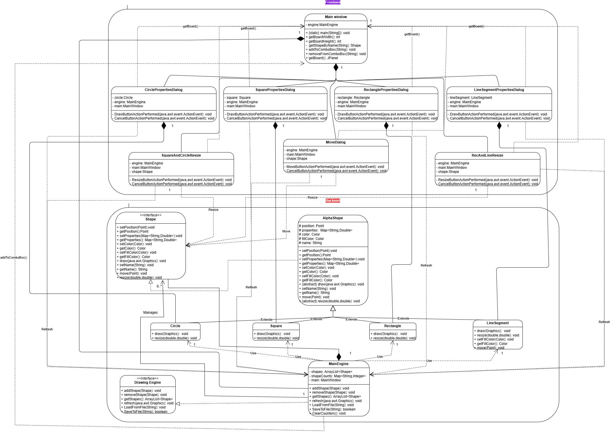

# Mini Paint Part 2 🎨  

A simple Java-based painting application that allows users to create, move, resize, save, and load geometric shapes. This project showcases Object-Oriented Programming (OOP) principles and a graphical user interface (GUI) built with the Swing library.

---

## Features 🌟  

1. **Shape Management**  
   - Create and manage shapes like **Circle**, **Rectangle**, **Square**, and **Line Segment**.  
   - Each shape has unique properties such as position, dimensions, and identifiers (e.g., `circle01`, `square04`).  

2. **Enhanced Shape Functionality**  
   - **Move:** Reposition shapes dynamically.  
   - **Resize:** Adjust shape dimensions.  

3. **File Operations**  
   - **Save:** Persist shapes to a file.  
   - **Load:** Retrieve shapes from a saved file.

4. **User-Friendly Interface**  
   - **Buttons** for shape creation.  
   - **Dialog boxes** for entering shape properties (e.g., position, size).  
   - **Dropdown menu** for selecting and manipulating shapes.

---

## Technologies Used 🛠️  

- **Java OOP** for robust and modular design.  
- **Swing Library** for a seamless GUI experience.  
- **Serialization** for saving and loading shapes.

## UML Class Diagram 📈  

The system's design is based on Object-Oriented Programming (OOP) principles, using inheritance and polymorphism to manage shapes. Below is a textual representation of the UML class diagram for the application:

